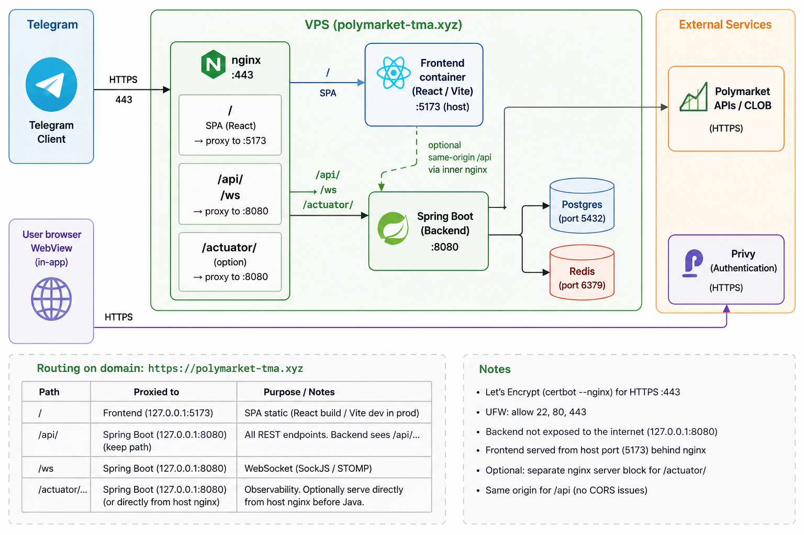
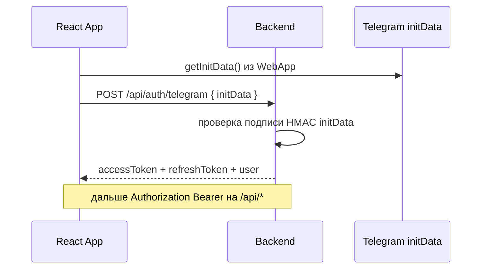

# Polymarket TMA — поток Telegram Mini App

Этот документ описывает сквозной поток: открытие Mini App, авторизация, API, кошелёк и торговля. Детали деплоя и Privy см. [setup.md](setup.md), [trading.md](trading.md), [deploy.md](deploy.md).

## 1. Высокоуровневая архитектура

В продакшене с **одним доменом** (`https://polymarket-tma.xyz`):

- **`/`** → прокси на фронт (статика/React из контейнера на хост-порту, например `5173`).
- **`/api/`** → прокси на **Spring** (`127.0.0.1:8080`), путь **не режется** — бэкенд видит `/api/...`.
- **`/ws`** → тот же бэкенд (SockJS/STOMP).
- **`/actuator/...`** → либо отдельный `location` на хостовом nginx до Java, либо через цепочку фронт-nginx (зависит от конфигурации).

Конфиг-пример: `deploy/nginx/sites-available/polymarket-tma`.

## 2. Загрузка Mini App

1. Пользователь открывает бота и нажимает кнопку **Mini App** (URL задаётся в BotFather).
2. Telegram WebView грузит **`index.html`** с домена приложения; подключается **`telegram-web-app.js`**.
3. Фронт вызывает `WebApp.ready()` / тема — см. `frontend/src/lib/telegram/webApp.ts`.

**Важно:** полноценный **`initData`** есть только **внутри Telegram**. В обычном браузере SDK отдаёт пустой `initData`; фронт может подставить **`mock-...`** для разработки — бэкенд с **настроенным `BOT_TOKEN`** такой payload **отвергает** (ошибки парсинга / 401).

## 3. Авторизация (Telegram → JWT)

- Реализация проверки: `TelegramInitDataValidator` (формат query string, `hash`, `auth_date`, TTL).
- Токены хранятся на клиенте (Zustand) и прикрепляются в axios — `frontend/src/lib/api/client.ts`.
- Обновление: `POST /api/auth/refresh`.

Подробности окружения и CORS: [setup.md](setup.md).

## 4. Кошелёк (Privy)

- Обёртка: `WalletProvider` (`frontend/src/features/wallet/PrivyProvider.tsx`). Без **`VITE_PRIVY_APP_ID`** на этапе **сборки** фронт собирается без Privy; с неверным ID провайдер падает при инициализации (**пустой экран**).
- **App ID** и прочие `VITE_*` **вкладываются при `pnpm build` / Docker build-arg**, а не подменяются рантаймовым `.env` на VPS для уже готового образа.
- В [Privy Dashboard](https://dashboard.privy.io) должны быть разрешены **allowed domains** (ваш HTTPS origin). Для входа через Telegram у Privy нужны согласованные настройки бота и домена (BotFather).

Адрес кошелька может сохраняться в профиле: `POST /api/wallet/address` перед подготовкой ордера.

## 5. Рынки и данные

- Списки/карточки рынков: публичные **`GET /api/markets`** и др. (бек проксирует/кэширует Gamma/CLOB).
- Детали, ордербук, история — см. `frontend/src/lib/api/endpoints.ts`.
- Живые обновления: **SockJS** на **`${VITE_API_BASE_URL}/ws`** или тот же origin **`/ws`** — `frontend/src/lib/ws/stompClient.ts`.

## 6. Торговля: YES / NO

Кратко (детали и прод-ограничения — [trading.md](trading.md)):

1. Пользователь жмёт **YES** или **NO** → открывается `MarketTradeSheet` (лимитная цена, сумма в USDC, расчёт shares).
2. **Подтверждение ордера** в UI: кнопка отправляет цепочку:
   - `POST /api/wallet/address` (если нужно обновить адрес),
   - `POST /api/orders/prepare` → typed data (EIP-712) + `orderHash`, кэш в Redis,
   - **Privy** `signTypedData`,
   - `POST /api/orders/submit` → бэкенд дергает Polymarket **CLOB** `POST /order`.

Деньги **не проходят через бэкенд TMA**: пользователь подписывает ордер в кошельке; исполнение и USDC — на Polygon / у Polymarket после матча и при корректных **approvals** и **CLOB credentials** (часть ещё в roadmap в коде).

## 7. Переменные окружения (шпаргалка)

| Назначение | Где задаётся |
|------------|----------------|
| `BOT_TOKEN`, `JWT_SECRET`, CORS, DB, Redis | Бэкенд: `.env` / Docker env |
| `VITE_PRIVY_APP_ID`, `VITE_API_BASE_URL`, `VITE_POLYGON_RPC_URL` | **Сборка** фронтенд-образа |
| Прокси домена | Хостовый **nginx** |

Для одного прод-домена часто **`VITE_API_BASE_URL` пустой** — запросы идут на `/api` того же origin.

## 8. Частые симптомы

| Симптом | Возможная причина |
|--------|-------------------|
| Пустой экран | Неверный `VITE_PRIVY_APP_ID`, ошибка JS в консоли |
| 401 `Malformed initData` | Открытие сайта вне Telegram (mock `initData`) или битое тело запроса |
| `Bot domain invalid` (OAuth Telegram / Privy) | Домен не привязан в BotFather / не в allowed domains Privy |
| 502 на `/api` | Бэкенд не слушает :8080 или неверный upstream nginx |
| Мусор в логах Tomcat на 8080 | Сканеры шлют не-HTTP/TLS на открытый порт — см. привязку `127.0.0.1:8080:8080` |

---

*Документ отражает состояние кодовой базы polymarket-tma; при изменении контрактов API или CLOB обновляйте разделы 6–7 и ссылку на [trading.md](trading.md).*
