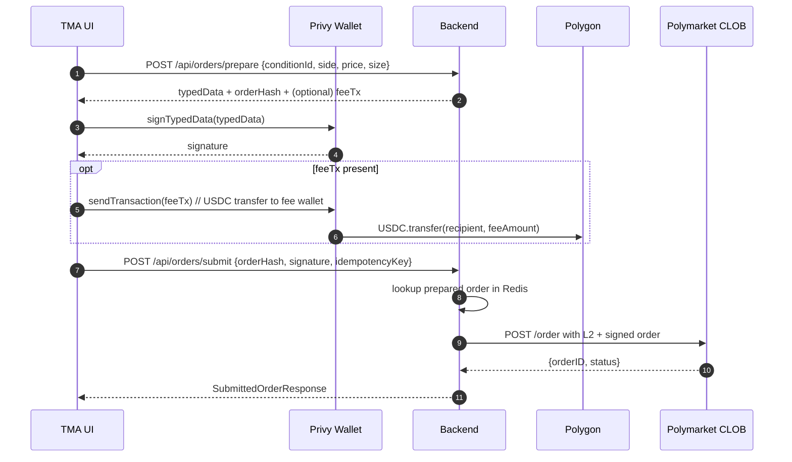
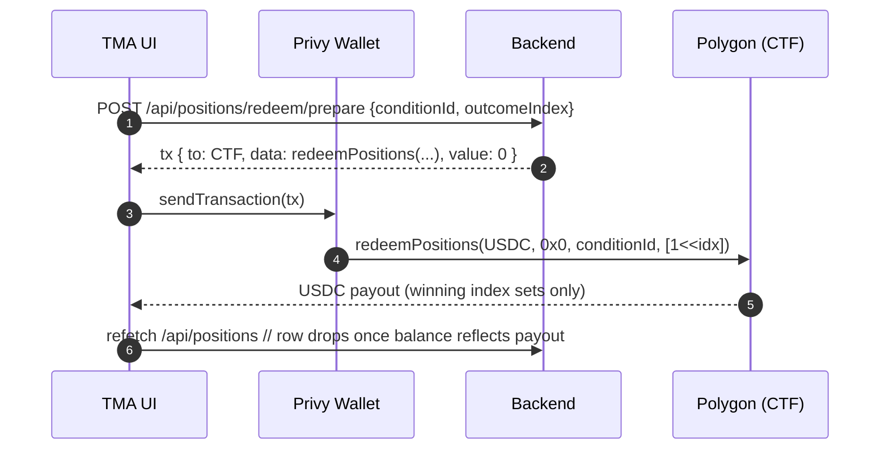

# Phase 2 — Trading status

Polymarket trading settles on **CTF Exchange (Polygon)**. The backend never holds users’ private keys: the browser (**Privy** embedded wallet) signs **EIP-712** typed data; the backend posts the signed order to the **CLOB**. After the May 2026 iteration the end-to-end loop **deposit → trade → redeem** is wired, plus a configurable platform fee (spread) on every prepared order.

## Phase 1 vs Phase 2 (implemented in-repo)

| Area | Phase 1 (read-mostly) | Phase 2 (trading scaffold) |
|------|------------------------|---------------------------|
| Markets, search | Gamma + public-search → list/detail | Same |
| Orderbook / prices | Gamma + CLOB public REST | Same |
| Price stream | CLOB WS → STOMP `/topic/market/{…}` (optional toggle) | Same |
| Identity | Telegram auth, JWT | Same |
| Wallet | Optional Privy when `VITE_PRIVY_APP_ID` | Privy on Polygon + USDC `balanceOf` via viem |
| Orders | — | `POST /api/orders/prepare`, `POST /api/orders/submit`, Redis pending cache, `order_audit` table |
| CLOB submit | — | `POST /order` with **L2 HMAC headers** when the user has derived credentials; falls back to unauthenticated post if not. L1 key derivation flow exposed at `/api/clob/auth/*` |
| Positions | — | `GET /api/positions` → Data API `GET /positions?user=<wallet>` (≈10s Redis cache); response includes title/icon/outcome/PnL/redeemable and a `favorite` flag joined from the local `favorite_market` table |
| Cancel | — | `DELETE /api/orders/{orderId}` → CLOB `DELETE /order` with L2 headers via `ClobL2Signer`. Returns `CLOB_AUTH_REQUIRED` if no credentials. |
| USDC / CTF approvals | — | `wallet/ApprovalCalldataBuilder`, `ApprovalStatusReader`, `ApprovalService`, `GET /api/wallet/approvals`; frontend `ApprovalsSection.tsx` |
| Canonical **order hash** | — | EIP-712 digest via web3j `StructuredDataEncoder`; `tokenId`/`uint256` fields emitted as decimal strings so Privy/viem do not lose precision |
| Redeem / claim winnings | — | `POST /api/positions/redeem/prepare` → unsigned `redeemPositions(...)` calldata. Frontend `PositionRow` exposes a Claim button per redeemable position. |
| Platform fee (spread) | — | `app.fees.spread-bps` + `app.fees.recipient-address`. When non-zero, `prepare` returns an extra USDC `transfer(recipient, fee)` tx the wallet broadcasts right after signing the order. Public preview at `GET /api/fees`. |

Key files:

- [OrderBuilder.java](../backend/src/main/java/com/polymarket/tma/trading/OrderBuilder.java)
- [PendingOrderCache.java](../backend/src/main/java/com/polymarket/tma/trading/PendingOrderCache.java)
- [TradingService.java](../backend/src/main/java/com/polymarket/tma/trading/TradingService.java)
- [ClobOrderClient.java](../backend/src/main/java/com/polymarket/tma/trading/ClobOrderClient.java)
- [PositionsClient.java](../backend/src/main/java/com/polymarket/tma/trading/PositionsClient.java)
- [RedeemCalldataBuilder.java](../backend/src/main/java/com/polymarket/tma/redeem/RedeemCalldataBuilder.java) · [RedeemService.java](../backend/src/main/java/com/polymarket/tma/redeem/RedeemService.java) · [RedeemController.java](../backend/src/main/java/com/polymarket/tma/redeem/RedeemController.java)
- [FeeCalldataBuilder.java](../backend/src/main/java/com/polymarket/tma/fees/FeeCalldataBuilder.java) · [FeeService.java](../backend/src/main/java/com/polymarket/tma/fees/FeeService.java) · [FeeController.java](../backend/src/main/java/com/polymarket/tma/fees/FeeController.java)
- [MarketTradeSheet.tsx](../frontend/src/features/trading/MarketTradeSheet.tsx) — prepare → Privy `signTypedData` → optional fee tx → submit
- [PositionRow.tsx](../frontend/src/features/trading/PositionRow.tsx) — inline Claim button per redeemable position
- [useWallet.ts](../frontend/src/features/wallet/useWallet.ts) — Privy wallets + Polygon USDC

## End-to-end order flow (current)



## End-to-end redeem flow (new)



---

## Privy “Sign and continue” failures — plausible causes vs this codebase

Privy shows a generic **“An error has occurred, please try again.”** Surface the underlying error in DevTools/console if possible.

### 1. **`typedData` numeric encoding (mitigated in code)**

[`OrderBuilder.build`](../backend/src/main/java/com/polymarket/tma/trading/OrderBuilder.java) emits **all** `uint256` / `uint8` fields in `domain` and `message` as **decimal strings**, including **`chainId`** in the domain, so large `tokenId` values are never rounded in JSON and viem/Privy see a single convention.

If signing still fails, use DevTools/remote debugging — remaining causes are often **wrong chain**, **maker ≠ active wallet**, or **signatureType** mismatch.

### 2. **`wallets[0]` vs signer used for EIP-712**

[`useWallet`](../frontend/src/features/wallet/useWallet.ts) resolves `address` from `wallets[0]`. Embedded vs external ordering can pick the wrong signer. Signing uses `{ address: w.address }`, while `maker`/`signer` in typed data come from the DB profile (**after `api.setWalletAddress`**). Any mismatch yields signing or verification errors.

Prefer selecting the exact **embedded Polygon wallet** that matches saved profile / `typedData.message.maker`.

### 3. **`signatureType` vs wallet model**

Defaults use **EOA** (`signatureType = 0`). Polymarket often relies on proxy/Safe flow; embedded smart accounts may need **POLY_PROXY / POLY_GNOSIS_SAFE** aligned with docs.

### 4. **`orderHash` vs CLOB bookkeeping**

The API’s `orderHash` is the **EIP-712 struct hash** from web3j `StructuredDataEncoder` (same digest the wallet uses when signing). CLOB may still use additional ids once L1/L2 submit is wired; treat server `orderHash` as the canonical digest of the prepared typed data.

---

## L1 / L2 CLOB auth (backend wiring)

Implemented in `backend/src/main/java/com/polymarket/tma/trading/clob`:

- `ClobAuthBuilder` — builds the EIP-712 `ClobAuth` typed data the wallet signs (domain `ClobAuthDomain`, chainId 137). All uint values are decimal strings.
- `ClobApiKeyClient` — `POST /auth/api-key` with `POLY_ADDRESS / POLY_SIGNATURE / POLY_TIMESTAMP / POLY_NONCE` headers. Returns `(apiKey, secret, passphrase)`.
- `ClobCredentialsStore` — Redis-cached creds per user with a 30 day TTL.
- `ClobL2Signer` — HMAC-SHA256 over `timestamp + METHOD + path + body`; URL-safe base64 in, URL-safe base64 out (mirrors py-clob-client).
- `ClobAuthController` — `/api/clob/auth/prepare | submit | status` (auth required), `DELETE /api/clob/auth` to wipe creds.
- `ClobOrderClient.submit(...)` — attaches `POLY_*` headers when `creds` are present.
- `ClobOrderClient.cancel(orderId, wallet, creds)` — `DELETE /order` with L2 headers and `{"orderID": ...}` body.

Frontend wiring:

1. Wallet page → "Connect to Polymarket trading" button:
   - `POST /api/clob/auth/prepare`
   - Privy `signTypedData(typedData)`
   - `POST /api/clob/auth/submit { signature, timestamp, nonce }`
2. On order rejection with 401/403 from CLOB the frontend wipes creds (`DELETE /api/clob/auth`) and prompts to re-derive.

## Approvals (USDC + Conditional Tokens)

Implemented in `backend/src/main/java/com/polymarket/tma/wallet`:

- `ApprovalCalldataBuilder` — pure ABI encoding for `approve(address,uint256)` (selector `0x095ea7b3`) and `setApprovalForAll(address,bool)` (selector `0xa22cb465`).
- `ApprovalStatusReader` — optional Polygon JSON-RPC reader for `allowance` (USDC) and `isApprovedForAll` (CTF). Returns `null` if RPC fails so callers degrade gracefully.
- `ApprovalService` — composes `UnsignedTx` list (`to`, `data`, `value=0x0`, `chainId=137`) for whatever is missing. USDC threshold ≥ `1_000_000` units (1 USDC) is treated as approved.
- `ApprovalController` — `GET /api/wallet/approvals` (auth required).

Polygon addresses (in `application.yml`):

| Key | Value |
|-----|-------|
| `app.polygon.usdc-address` | `0x2791Bca1f2de4661ED88A30C99A7a9449Aa84174` |
| `app.polygon.ctf-address` | `0x4D97DCd97eC945f40cF65F87097ACe5EA0476045` |
| `app.polygon.ctf-exchange-address` (CTF Exchange v2) | `0xE111180000d2663C0091e4f400237545B87B996B` |
| `app.polygon.neg-risk-ctf-exchange-address` (NegRisk CTF Exchange v2) | `0xe2222d279d744050d28e00520010520000310F59` |

> **Note (CLOB v2 migration, 2026-04-22).** Polymarket migrated to a new CTF Exchange contract pair on 2026-04-22; the legacy v1 exchange (`0x4bFb41d5B3570DeFd03C39a9A4D8dE6Bd8B8982E`) has been rejecting new orders with `400 "order_version_mismatch"` since 2026-04-30. Existing USDC / CTF approvals on the v1 contract are useless — users must re-approve the v2 exchange on first trade. See `OrderBuilder` for the new EIP-712 schema and [py-clob-client-v2](https://github.com/Polymarket/py-clob-client-v2) for the upstream reference.

### Open external blocker — deposit-wallet flow (`CLOB_DEPOSIT_WALLET_REQUIRED`)

Even with the v2 EIP-712 schema correct, Polymarket CLOB rejects orders submitted with a raw EOA in `maker`/`signer`:

```
400 {"error":"maker address not allowed, please use the deposit wallet flow"}
```

The 2026-04-22 v2 migration effectively deprecated direct EOA trading. Every wallet now needs a Polymarket-side **deposit wallet**: a CREATE2 proxy contract derived from the EOA, with funds held by the proxy and orders signed via `signatureType=3` (POLY_1271, ERC-7739-wrapped). The proxy is *counterfactual* until the user does at least one trade through `polymarket.com` — then it is deployed and orders can be placed via API.

As of mid-May 2026 the upstream story is still broken end-to-end:

- [py-clob-client-v2 #51](https://github.com/Polymarket/py-clob-client-v2/issues/51) — original "EOA orders rejected" report, still open.
- [py-clob-client-v2 #53](https://github.com/Polymarket/py-clob-client-v2/issues/53) — confirms the 2026-04-22 cutover deprecated EOA mode.
- [py-clob-client-v2 #61](https://github.com/Polymarket/py-clob-client-v2/issues/61) — even with `signatureType=2` and a deployed proxy, fresh accounts get the same 400.
- [py-clob-client-v2 #63](https://github.com/Polymarket/py-clob-client-v2/issues/63) — POLY_1271 (`signatureType=3`) is rejected because L1 API key auth ties the key to the EOA but the order signer is the proxy. Polymarket support has confirmed the rejection is "not expected" but no resolution has shipped.
- [py-clob-client-v2 #64](https://github.com/Polymarket/py-clob-client-v2/issues/64) — diagnostic for "proxy not deployed yet" and notes that Privy / social-login wallets get a special TSS-wallet path.

**What we do today:** `ClobOrderClient.mapClobError` translates the 400 into a structured `CLOB_DEPOSIT_WALLET_REQUIRED` code; `MarketTradeSheet`'s error toast renders a UI-friendly "open polymarket.com with this wallet, deposit USDC, place one small trade" message instead of the raw upstream blob. Beyond that, the flow is on hold until upstream stabilises.

**What we'd need to add (when the upstream is fixed):**

1. Resolve the user's deposit-wallet address from the EOA (either via Polymarket profile HTML — `proxyAddress` field — or a deterministic CREATE2 derivation, once Polymarket publishes the rules from #61).
2. Switch `OrderBuilder` to `signatureType=3`, `maker = proxy`, `signer = EOA`, and produce an ERC-7739-wrapped POLY_1271 signature (Privy `signTypedData` is fine for the inner EIP-712, the wrapping is post-processing).
3. Reset L1/L2 credentials when switching maker; cache invalidation already handles re-derivation on the wallet page.

Frontend wiring (`ApprovalsSection.tsx`): calls `GET /api/wallet/approvals`, sends each `missing[i]` as a regular Polygon tx via Privy (`{to, data, value:'0x0', chainId:137}`), refetches afterwards.

## Redeem (claim winnings)

Implemented in `backend/src/main/java/com/polymarket/tma/redeem`:

- `RedeemCalldataBuilder` — pure ABI encoding for `redeemPositions(IERC20,bytes32,bytes32,uint256[])` on the Conditional Tokens Framework. `parentCollectionId` defaults to the all-zero bytes32 (top-level Polymarket markets); `indexSet = 1 << outcomeIndex` for the position the user wants to burn.
- `RedeemService` — given `(conditionId, outcomeIndex)` + the caller's wallet, returns an `UnsignedTx` targeting `app.polygon.ctf-address`.
- `RedeemController` — `POST /api/positions/redeem/prepare` (auth required).

Frontend wiring (`PositionRow.tsx`): Claim button rendered when `position.redeemable === true`; on click → `prepareRedeem` → Privy `useSendTransaction` → on success the React-Query positions cache is invalidated. The CTF reverts harmlessly if the market is not actually resolved on-chain.

## maker / signer per `signatureType`

`PrepareOrderRequest` gains an optional **`makerAddress`** field. Resolution in `TradingService.prepare`:

| signatureType | maker | signer |
|----------------|-------|--------|
| `EOA` (default) | wallet | wallet |
| `POLY_PROXY` | required `makerAddress` (proxy) | wallet |
| `POLY_GNOSIS_SAFE` | required `makerAddress` (Safe) | wallet |

For non-EOA the request fails with `MAKER_REQUIRED` if `makerAddress` is missing, or `MAKER_EQUALS_SIGNER` if equal to the wallet. `OrderBuilder.build(maker, signer, req)` writes the two distinct fields into the EIP-712 message.

---

## CLOB v2 order schema

Polymarket replaced their CTF Exchange in April 2026; the new schema is what `OrderBuilder` and `ClobOrderClient` now build. Fields and where they are emitted on the wire:

| Field | EIP-712 type | Wire JSON type | Notes |
|-------|--------------|----------------|-------|
| `salt` | `uint256` | **JSON number** | Generated < 2^53 to survive float64 server-side parsing |
| `maker` | `address` | string | Wallet (EOA) or proxy/Safe holding the funds |
| `signer` | `address` | string | Always the wallet doing the signature |
| `tokenId` | `uint256` | string | Decimal big-int — 256 bits, so JSON number would lose precision |
| `makerAmount` / `takerAmount` | `uint256` | string | 6-decimal USDC or share units |
| `side` | `uint8` (0/1) | `"BUY"`/`"SELL"` string | Wire encoding differs from signed digest — CLOB reconstructs server-side |
| `signatureType` | `uint8` | **JSON number** | 0=EOA, 1=POLY_PROXY, 2=POLY_GNOSIS_SAFE |
| `timestamp` | `uint256` | string ms | NEW in v2; replaces the v1 `nonce` for uniqueness |
| `metadata` | `bytes32` | hex string | NEW in v2; defaults to `0x00…00` |
| `builder` | `bytes32` | hex string | NEW in v2; defaults to `0x00…00` (set for builder attribution) |
| `expiration` | — *(API-only)* | string seconds | Wire-only in v2; NOT part of the signed digest. Default `"0"` (no expiry) |
| `signature` | — | string | Wallet signature lives **inside** the `order` object |

Top-level envelope:

```json
{
  "order": { ... },
  "owner": "<API key UUID>",
  "orderType": "GTC",
  "deferExec": false,
  "postOnly": false
}
```

`owner` is the L2 API key UUID in v2 (the wallet maker in v1). The EIP-712 domain is `name="Polymarket CTF Exchange"`, **`version="2"`**, `chainId=137`, with `verifyingContract` switching between standard and NegRisk based on `MarketDto.negRisk`.

Regression coverage: [`OrderBuilderTest`](../backend/src/test/java/com/polymarket/tma/trading/OrderBuilderTest.java) (struct shape, salt range, NegRisk routing) and [`ClobOrderClientPayloadTest`](../backend/src/test/java/com/polymarket/tma/trading/ClobOrderClientPayloadTest.java) (wire JSON shape, `owner`, `deferExec`/`postOnly`, presence/absence of v1 fields).

---

## Monetization — configurable spread / fee

A platform fee can be charged on every prepared order. It is **independent** of the CLOB-side `feeRateBps` (which is reserved for the exchange operator) and lands as a regular ERC-20 `transfer` on Polygon to a configured wallet.

### Configuration (`application.yml`)

| Key | Env | Default | Description |
|-----|-----|---------|-------------|
| `app.fees.spread-bps` | `TRADING_FEE_BPS` | `0` | Fee in basis points (100 = 1%, 50 = 0.5%). `0` disables. |
| `app.fees.recipient-address` | `TRADING_FEE_RECIPIENT` | `""` | Polygon USDC recipient. Empty disables. |

### Wire-level flow

1. `POST /api/orders/prepare` builds the order; [`FeeService.quote`](../backend/src/main/java/com/polymarket/tma/fees/FeeService.java) computes `fee = price × size × spreadBps / 10_000` (USDC, 6 decimals) and produces an `UnsignedTx` for `USDC.transfer(recipient, fee)`.
2. The backend response carries the original `typedData` + `orderHash` and adds:

   ```json
   {
     "feeTx": { "kind": "TRADING_FEE_TRANSFER", "to": "<USDC>", "data": "0xa9059cbb…", "value": "0x0", "chainId": 137 },
     "feeAmountUsdc": "0.025",
     "feeBps": 50
   }
   ```
3. Frontend `MarketTradeSheet`:
   - signs the order via Privy `signTypedData`,
   - if `feeTx` is present, broadcasts it via Privy `useSendTransaction`,
   - submits `{orderHash, signature}` to `POST /api/orders/submit`.
4. `GET /api/fees` exposes the public fee config so the trade sheet can render the preview row (`Platform fee 0.50% · ≈ $0.025 USDC`) before the user signs anything.

### Why a separate transfer (and not the CLOB `feeRateBps`)

Polymarket’s `feeRateBps` field on the EIP-712 order goes to the **CLOB operator**, not to a third-party wallet, so it cannot route the platform’s share. The cleanest MVP is to issue a USDC transfer immediately after signing: it is a single extra Polygon tx, gas is paid by the user, and the operator wallet sees a clean `transfer(...)` per bet.

### Limitations / follow-ups

- The fee is charged at **submission**, not at fill. If the order never matches, the fee is still collected — that is the intended "bet placement" pricing model. If you need fill-only fees, switch to a custodial smart-contract escrow.
- The fee tx is paid in MATIC for gas. Future work: sponsor gas via a paymaster (Privy session signers can do this).
- `order_audit` does not yet record `fee_amount` / `fee_tx_hash`. Adding two columns + a Flyway migration is on the production checklist below.

## Geoblock — Polymarket CLOB region restrictions

CLOB sits behind Cloudflare and rejects `POST /order` (and several other endpoints) with HTTP **403 "Trading restricted in your region"** when the server's outbound IP falls into a restricted jurisdiction. The backend recognises that response shape and surfaces a dedicated error code `CLOB_GEOBLOCKED` so the UI / logs make the root cause obvious.

### Hosting strategy

Polymarket's geoblock list is wider than just "EU". It is enforced via Cloudflare WAF on `POST /order` (and several other endpoints) using IP-geo + ASN signals. Empirically verified against the real CLOB on this project (and corroborated by [polymarket/clob-client#231](https://github.com/Polymarket/clob-client/issues/231) and [Polymarket Help Center — Geographic Restrictions](https://help.polymarket.com/en/articles/13364163-geographic-restrictions)):

| Region | International CLOB | Notes |
|---|---|---|
| Hetzner **HEL1** (Helsinki, Finland) | **works** | Cheapest reliable option (~€5/mo). Recommended for MVP. |
| AWS **eu-west-1** (Dublin, Ireland) | **works** | Polymarket matching engine sits in AWS eu-west-2 London → ~0.5 ms latency from Dublin. Best for HFT-style integrators. |
| Vultr **Stockholm / Madrid** | usually works | Subject to confirmation per /24 — verify with `clob-post-probe`. |
| DigitalOcean **ams3** (Amsterdam) | conditional | Polymarket UI is blocked for NL but several integrators report the CLOB API path itself works. Cheap to A/B test before committing. |
| DigitalOcean **fra1 / lon1**, Hetzner **NBG/FSN/HEL FRA**, Scaleway Paris | blocked (Germany / UK / FR all geoblocked) | |
| DigitalOcean / AWS **US regions** (incl. nyc1, sfo3, us-east-1) | blocked | The international CLOB rejects US IPs; Polymarket runs a separate CFTC-regulated US API (KYC required, different endpoint). |
| DigitalOcean **tor1 / sgp1 / blr1** | blocked | CA / SG / IN. |

**Do not use residential / VPN proxies** (Bright Data Residential, Oxylabs Residential, mobile-carrier IPv6 pools): even when Cloudflare classifies the egress IP as `loc=US`, Polymarket's WAF flags those ranges as `proxy/threat_score>5` and blocks the same `POST /order`. Polymarket's Terms of Service §2.1.4 also explicitly forbid VPN/evasion. Datacenter IPv4 in an allowed jurisdiction is the only sustainable path.

### Operator diagnostics (`/api/diagnostics/*`)

The backend exposes three public probes that go through the same `WebClient` the trading flow uses, so connectivity issues can be triaged without redeploying:

| Endpoint | Purpose |
|---|---|
| `GET /api/diagnostics/clob-egress-ip` | Egress IP via `ifconfig.me/ip` — confirms what the upstream sees. |
| `GET /api/diagnostics/cf-trace` | Cloudflare's `cdn-cgi/trace`. Most important field: `loc=`. Must be `US` after deploy/migration. |
| `GET /api/diagnostics/clob-post-probe[?ua=...]` | Empty `POST /order`. Healthy region returns 400/401/422 (real signing path passes through the WAF). 403 + "Trading restricted" means the host is in a blocked region. Optional `ua` overrides User-Agent. |

These are not behind auth on purpose — they don't reveal credentials, only the externally visible IP and Cloudflare classification.

### Trade flow ordering

The frontend trade flow is `prepare → sign → submit → fee tx`. If CLOB rejects the order (geoblock or otherwise) the on-chain platform fee is **not** charged. Earlier the fee ran first, so a geoblocked submit would leave the user paying for nothing.

## Production TODO (remaining)

1. **Audit fee tx hash** on the `order_audit` row (`fee_amount`, `fee_recipient`, `fee_tx_hash`) — Flyway `V2__order_audit_fees.sql` + service plumbing.
2. **Notifications** for "market resolved / claim available" (`docs/ToDo.txt` C):
   - polling `/api/positions` per active user every N minutes,
   - cross-reference `redeemable=true` and emit a Telegram Bot message via the existing `app.telegram.bot-token`,
   - debounce per `(user, conditionId)` so the same payout is announced once.
3. **Approval auto-refresh** — schedule re-read after tx confirmation; surface tx hash to UI (already half-done in `ApprovalsSection`).
4. **Cancel UI** — there is no list of open CLOB orders rendered to the user yet, so the wired `DELETE /api/orders/{id}` endpoint waits on a "My orders" screen.

---

## Risk controls

- Redis token bucket per user on order endpoints when enabled.
- Cap `makerAmount` / notional pre-submit server-side.
- Geo/KYC gates before unlocking trading flows.
- `app.trading.enabled=false`-style killswitch when wired.
- Fee killswitch: set `app.fees.spread-bps=0` to disable monetization without redeploying anything else.
