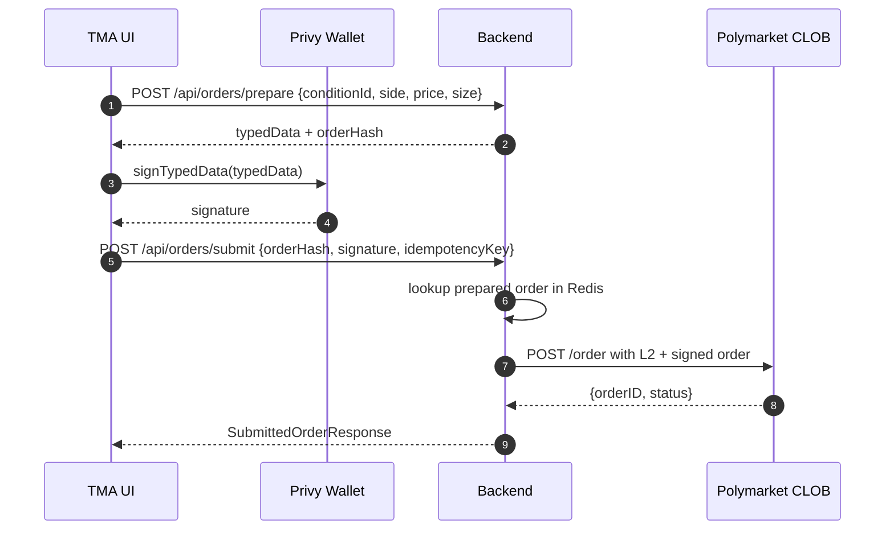

# Phase 2 — Trading status

Polymarket trading settles on **CTF Exchange (Polygon)**. The backend never holds users’ private keys: the browser (**Privy** embedded wallet) signs **EIP-712** typed data; the backend posts the signed order to the **CLOB**.

## Phase 1 vs Phase 2 (implemented in-repo)

| Area | Phase 1 (read-mostly) | Phase 2 (trading scaffold) |
|------|------------------------|---------------------------|
| Markets, search | Gamma + public-search → list/detail | Same |
| Orderbook / prices | Gamma + CLOB public REST | Same |
| Price stream | CLOB WS → STOMP `/topic/market/{…}` (optional toggle) | Same |
| Identity | Telegram auth, JWT | Same |
| Wallet | Optional Privy when `VITE_PRIVY_APP_ID` | Privy on Polygon + USDC `balanceOf` via viem |
| Orders | — | `POST /api/orders/prepare`, `POST /api/orders/submit`, Redis pending cache, `order_audit` table |
| CLOB submit | — | **Scaffold**: `POST /order` **without full L1/L2 CLOB credentials** |
| Positions | — | `GET /api/positions` → Data API `GET /positions?user=<wallet>` (≈10s Redis cache) |
| Cancel | — | `DELETE /api/orders/{orderId}` returns `CLOB_NOT_WIRED` (placeholder) |
| USDC / CTF approvals | — | **Not implemented** |
| Canonical **order hash** | — | **Placeholder** (`OrderBuilder`; not real EIP-712 digest → CLOB will not accept real flow as-is) |
| Redeem / claim winnings | — | **Not implemented** (on-chain only)

Key files:

- [OrderBuilder.java](../backend/src/main/java/com/polymarket/tma/trading/OrderBuilder.java)
- [PendingOrderCache.java](../backend/src/main/java/com/polymarket/tma/trading/PendingOrderCache.java)
- [TradingService.java](../backend/src/main/java/com/polymarket/tma/trading/TradingService.java)
- [ClobOrderClient.java](../backend/src/main/java/com/polymarket/tma/trading/ClobOrderClient.java)
- [PositionsClient.java](../backend/src/main/java/com/polymarket/tma/trading/PositionsClient.java)
- [MarketTradeSheet.tsx](../frontend/src/features/trading/MarketTradeSheet.tsx) — prepare → Privy `signTypedData` → submit
- [useWallet.ts](../frontend/src/features/wallet/useWallet.ts) — Privy wallets + Polygon USDC

## Target end-to-end order flow

**Today**: step to CLOB is missing **derived API credentials (L1)** and **request signing (L2)**. Even a valid wallet signature often cannot be traded end-to-end until those are wired.

---

## Privy “Sign and continue” failures — plausible causes vs this codebase

Privy shows a generic **“An error has occurred, please try again.”** Surface the underlying error in DevTools/console if possible.

### 1. **`typedData` numeric encoding inconsistencies**

[`OrderBuilder.build`](../backend/src/main/java/com/polymarket/tma/trading/OrderBuilder.java) mixes representations that become JSON fields:

- `uint256`-like strings: `salt`, `tokenId`, `makerAmount`, `takerAmount`, `nonce`
- JSON numbers: `expiration`, `feeRateBps`, `side`, `signatureType`
- `domain.chainId` as **integer** `137` while the domain schema lists `chainId` as `uint256`

Libraries behind Privy (often **viem**) expect a **consistent** encoding for EIP-712 integers (typically **decimal strings** for large `uint256`s). Mixed number/string/domain types can reject before any backend submit.

### 2. **`wallets[0]` vs signer used for EIP-712**

[`useWallet`](../frontend/src/features/wallet/useWallet.ts) resolves `address` from `wallets[0]`. Embedded vs external ordering can pick the wrong signer. Signing uses `{ address: w.address }`, while `maker`/`signer` in typed data come from the DB profile (**after `api.setWalletAddress`**). Any mismatch yields signing or verification errors.

Prefer selecting the exact **embedded Polygon wallet** that matches saved profile / `typedData.message.maker`.

### 3. **`signatureType` vs wallet model**

Defaults use **EOA** (`signatureType = 0`). Polymarket often relies on proxy/Safe flow; embedded smart accounts may need **POLY_PROXY / POLY_GNOSIS_SAFE** aligned with docs.

### 4. **`orderHash` is not the EIP-712 digest**

Lines ~121–122 use a synthetic string, **not** the keccak EIP-712 struct hash CLOB verifies. Signing still uses canonical typed-data hashing internally, but your **stored `orderHash`** and any off-chain bookkeeping are misleading until [`StructuredDataEncoder`](https://docs.web3j.io/4.x/advanced/eth_sign_TYPED_DATA/) or equivalent matches CLOB expectations.

---

## Production TODO (unchanged in spirit)

1. **L1 derive CLOB credentials** — EIP-712 “API key derivation” wallet signature → CLOB `{apiKey, secret, passphrase}`; persist per user securely.
2. **L2 HMAC** — `POLY_SIGNATURE` etc. over `timestamp + method + path + body` per CLOB docs.
3. **Approvals** — USDC allowance + Conditional Tokens approval for Exchange; optionally return raw txs from backend for Privy broadcast.
4. **Real `orderHash`** — match CLOB EIP-712 digest (remove nanoTime placeholder).
5. **Cancel** — map to CLOB `DELETE /order` with L2 headers.
6. **Positions UX** — keep Data API proxy; extend once you need resolution/redeem fields.

---

## Risk controls

- Redis token bucket per user on order endpoints when enabled.
- Cap `makerAmount` / notional pre-submit server-side.
- Geo/KYC gates before unlocking trading flows.
- `app.trading.enabled=false`-style killswitch when wired.
