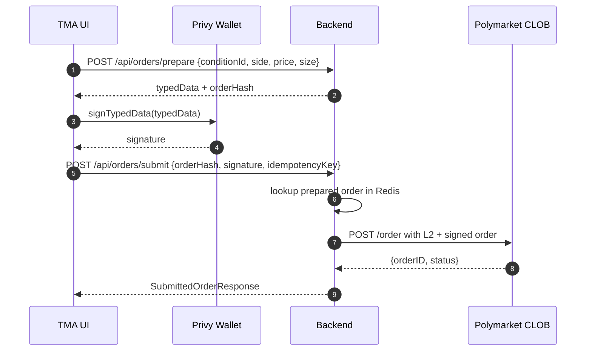

# Phase 2 — Trading status

Polymarket trading settles on **CTF Exchange (Polygon)**. The backend never holds users’ private keys: the browser (**Privy** embedded wallet) signs **EIP-712** typed data; the backend posts the signed order to the **CLOB**.

## Phase 1 vs Phase 2 (implemented in-repo)

| Area | Phase 1 (read-mostly) | Phase 2 (trading scaffold) |
|------|------------------------|---------------------------|
| Markets, search | Gamma + public-search → list/detail | Same |
| Orderbook / prices | Gamma + CLOB public REST | Same |
| Price stream | CLOB WS → STOMP `/topic/market/{…}` (optional toggle) | Same |
| Identity | Telegram auth, JWT | Same |
| Wallet | Optional Privy when `VITE_PRIVY_APP_ID` | Privy on Polygon + USDC `balanceOf` via viem |
| Orders | — | `POST /api/orders/prepare`, `POST /api/orders/submit`, Redis pending cache, `order_audit` table |
| CLOB submit | — | `POST /order` with **L2 HMAC headers** when the user has derived credentials; falls back to unauthenticated post if not. L1 key derivation flow exposed at `/api/clob/auth/*` |
| Positions | — | `GET /api/positions` → Data API `GET /positions?user=<wallet>` (≈10s Redis cache) |
| Cancel | — | `DELETE /api/orders/{orderId}` returns `CLOB_NOT_WIRED` (placeholder) |
| USDC / CTF approvals | — | **Not implemented** |
| Canonical **order hash** | — | **EIP-712 digest** via web3j `StructuredDataEncoder` (same hash wallets sign). **TypedData** emits all `uint256` / `uint8` fields as **decimal strings** (incl. `domain.chainId`) so Privy/viem do not lose precision on large `tokenId`. CLOB acceptance still needs **L1/L2** and exact POST body rules. |
| Redeem / claim winnings | — | **Not implemented** (on-chain only)

Key files:

- [OrderBuilder.java](../backend/src/main/java/com/polymarket/tma/trading/OrderBuilder.java)
- [PendingOrderCache.java](../backend/src/main/java/com/polymarket/tma/trading/PendingOrderCache.java)
- [TradingService.java](../backend/src/main/java/com/polymarket/tma/trading/TradingService.java)
- [ClobOrderClient.java](../backend/src/main/java/com/polymarket/tma/trading/ClobOrderClient.java)
- [PositionsClient.java](../backend/src/main/java/com/polymarket/tma/trading/PositionsClient.java)
- [MarketTradeSheet.tsx](../frontend/src/features/trading/MarketTradeSheet.tsx) — prepare → Privy `signTypedData` → submit
- [useWallet.ts](../frontend/src/features/wallet/useWallet.ts) — Privy wallets + Polygon USDC

## Target end-to-end order flow

**Today**: step to CLOB is missing **derived API credentials (L1)** and **request signing (L2)**. Even a valid wallet signature often cannot be traded end-to-end until those are wired.

---

## Privy “Sign and continue” failures — plausible causes vs this codebase

Privy shows a generic **“An error has occurred, please try again.”** Surface the underlying error in DevTools/console if possible.

### 1. **`typedData` numeric encoding (mitigated in code)**

[`OrderBuilder.build`](../backend/src/main/java/com/polymarket/tma/trading/OrderBuilder.java) now emits **all** `uint256` / `uint8` fields in `domain` and `message` as **decimal strings**, including **`chainId`** in the domain, so large `tokenId` values are never rounded in JSON and viem/Privy see a single convention.

If signing still fails, use DevTools/remote debugging — remaining causes are often **wrong chain**, **maker ≠ active wallet**, or **signatureType** mismatch.

### 2. **`wallets[0]` vs signer used for EIP-712**

[`useWallet`](../frontend/src/features/wallet/useWallet.ts) resolves `address` from `wallets[0]`. Embedded vs external ordering can pick the wrong signer. Signing uses `{ address: w.address }`, while `maker`/`signer` in typed data come from the DB profile (**after `api.setWalletAddress`**). Any mismatch yields signing or verification errors.

Prefer selecting the exact **embedded Polygon wallet** that matches saved profile / `typedData.message.maker`.

### 3. **`signatureType` vs wallet model**

Defaults use **EOA** (`signatureType = 0`). Polymarket often relies on proxy/Safe flow; embedded smart accounts may need **POLY_PROXY / POLY_GNOSIS_SAFE** aligned with docs.

### 4. **`orderHash` vs CLOB bookkeeping**

The API’s `orderHash` is now the **EIP-712 struct hash** from web3j `StructuredDataEncoder` (same digest the wallet uses when signing). CLOB may still use additional ids once L1/L2 submit is wired; treat server `orderHash` as the canonical digest of the prepared typed data.

---

## L1 / L2 CLOB auth (backend wiring)

Implemented in `backend/src/main/java/com/polymarket/tma/trading/clob`:

- `ClobAuthBuilder` — builds the EIP-712 `ClobAuth` typed data the wallet signs (domain `ClobAuthDomain`, chainId 137). All uint values are decimal strings.
- `ClobApiKeyClient` — `POST /auth/api-key` with `POLY_ADDRESS / POLY_SIGNATURE / POLY_TIMESTAMP / POLY_NONCE` headers. Returns `(apiKey, secret, passphrase)`.
- `ClobCredentialsStore` — Redis-cached creds per user with a 30 day TTL.
- `ClobL2Signer` — HMAC-SHA256 over `timestamp + METHOD + path + body`; URL-safe base64 in, URL-safe base64 out (mirrors py-clob-client).
- `ClobAuthController` — `/api/clob/auth/prepare | submit | status` (auth required), `DELETE /api/clob/auth` to wipe creds.
- `ClobOrderClient.submit(built, signature, wallet, creds)` — attaches `POLY_*` headers when `creds` are present.

Frontend wiring still to do:

1. Wallet page → "Connect to Polymarket trading" button:
   - `POST /api/clob/auth/prepare`
   - Privy `signTypedData(typedData)`
   - `POST /api/clob/auth/submit { signature, timestamp, nonce }`
2. Optional: on order rejection with 401 from CLOB → wipe creds (`DELETE /api/clob/auth`) and prompt to re-derive.

## Approvals (USDC + Conditional Tokens)

Implemented in `backend/src/main/java/com/polymarket/tma/wallet`:

- `ApprovalCalldataBuilder` — pure ABI encoding for `approve(address,uint256)` (selector `0x095ea7b3`) and `setApprovalForAll(address,bool)` (selector `0xa22cb465`).
- `ApprovalStatusReader` — optional Polygon JSON-RPC reader for `allowance` (USDC) and `isApprovedForAll` (CTF). Returns `null` if RPC fails so callers degrade gracefully.
- `ApprovalService` — composes `UnsignedTx` list (`to`, `data`, `value=0x0`, `chainId=137`) for whatever is missing. USDC threshold ≥ `1_000_000` units (1 USDC) is treated as approved.
- `ApprovalController` — `GET /api/wallet/approvals` (auth required).

Polygon addresses (in `application.yml`):

| Key | Value |
|-----|-------|
| `app.polygon.usdc-address` | `0x2791Bca1f2de4661ED88A30C99A7a9449Aa84174` |
| `app.polygon.ctf-address` | `0x4D97DCd97eC945f40cF65F87097ACe5EA0476045` |
| `app.polygon.ctf-exchange-address` | `0x4bFb41d5B3570DeFd03C39a9A4D8dE6Bd8B8982E` |

Frontend wiring to do: call `GET /api/wallet/approvals`, send each `missing[i]` as a regular Polygon tx via Privy (`{to, data, value:'0x0', chainId:137}`), refresh status afterwards.

## maker / signer per `signatureType`

`PrepareOrderRequest` gains an optional **`makerAddress`** field. Resolution in `TradingService.prepare`:

| signatureType | maker | signer |
|----------------|-------|--------|
| `EOA` (default) | wallet | wallet |
| `POLY_PROXY` | required `makerAddress` (proxy) | wallet |
| `POLY_GNOSIS_SAFE` | required `makerAddress` (Safe) | wallet |

For non-EOA the request fails with `MAKER_REQUIRED` if `makerAddress` is missing, or `MAKER_EQUALS_SIGNER` if equal to the wallet. `OrderBuilder.build(maker, signer, req)` writes the two distinct fields into the EIP-712 message.

## Production TODO (remaining)

1. **Cancel** — map `DELETE /api/orders/{id}` to CLOB `DELETE /order` with L2 headers (reuse `ClobL2Signer`).
2. **Positions UX** — keep Data API proxy; extend once resolution/redeem fields are required.
3. **Approval auto-refresh** — schedule re-read after tx confirmation; surface tx hash to UI.

---

## Risk controls

- Redis token bucket per user on order endpoints when enabled.
- Cap `makerAmount` / notional pre-submit server-side.
- Geo/KYC gates before unlocking trading flows.
- `app.trading.enabled=false`-style killswitch when wired.
