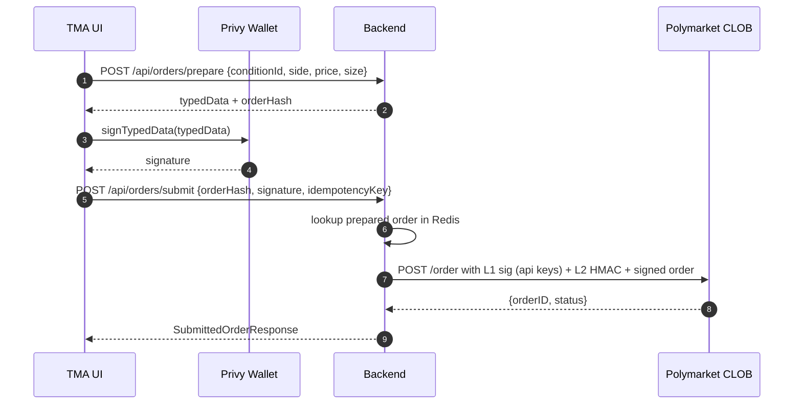

# Phase 2 - Trading

Polymarket trading happens on the CTF Exchange smart contract on Polygon. Our backend never holds
keys; signing is performed in the browser by the user's Privy embedded wallet.

## End-to-end order flow

Backend modules:

- [OrderBuilder.java](../backend/src/main/java/com/polymarket/tma/trading/OrderBuilder.java) builds EIP-712 typed data.
- [PendingOrderCache.java](../backend/src/main/java/com/polymarket/tma/trading/PendingOrderCache.java) holds prepared orders briefly so they can be matched to their signature.
- [ClobOrderClient.java](../backend/src/main/java/com/polymarket/tma/trading/ClobOrderClient.java) posts the signed order to the CLOB.
- [TradingService.java](../backend/src/main/java/com/polymarket/tma/trading/TradingService.java) orchestrates everything and writes to `order_audit`.

## TODO before production

The current `ClobOrderClient` posts the signed order without CLOB API credentials. To enable real
trading the following pieces are required:

1. **L1 - derive API key**: ask the user's wallet to sign the canonical "CLOB key derivation"
   EIP-712 payload. Send the signature to `POST /auth/api-key` on the CLOB. CLOB returns
   `{apiKey, secret, passphrase}` keyed to the wallet. Store securely server-side (Redis with TTL or
   Postgres with column-level encryption); rotate on user request.
2. **L2 - HMAC every request**: every CLOB request must include headers
   `POLY_ADDRESS`, `POLY_SIGNATURE` (HMAC-SHA256 of `timestamp + method + path + body` keyed on the
   secret, base64url encoded), `POLY_TIMESTAMP`, `POLY_API_KEY`, `POLY_PASSPHRASE`, `POLY_NONCE`.
3. **Approvals**: before the first order, the user must call `approve(CTFExchange, max)` on USDC
   and `setApprovalForAll(CTFExchange, true)` on the conditional tokens contract. Expose
   `POST /api/wallet/approve-tx` that returns unsigned transactions; the client signs and
   submits them via Privy.
4. **Order hash**: compute the keccak256 EIP-712 digest with web3j's
   `StructuredDataEncoder` so the `orderHash` we return matches the one CLOB will index by.
5. **Cancels**: implement `DELETE /api/orders/{id}` mapped to CLOB `DELETE /order` with L2 auth.
6. **Positions**: proxy `GET https://data-api.polymarket.com/positions?user=<wallet>`; cache 10 s in Redis.

## Risk controls

- Per-user rate limiter in Redis (token bucket: 20 orders / minute by default).
- Hard upper bound on `makerAmount` per submission (e.g. $10 000 in MVP).
- KYC / geo block list before unblocking the wallet flow.
- Maintenance switch via Spring property `app.trading.enabled=false`.
