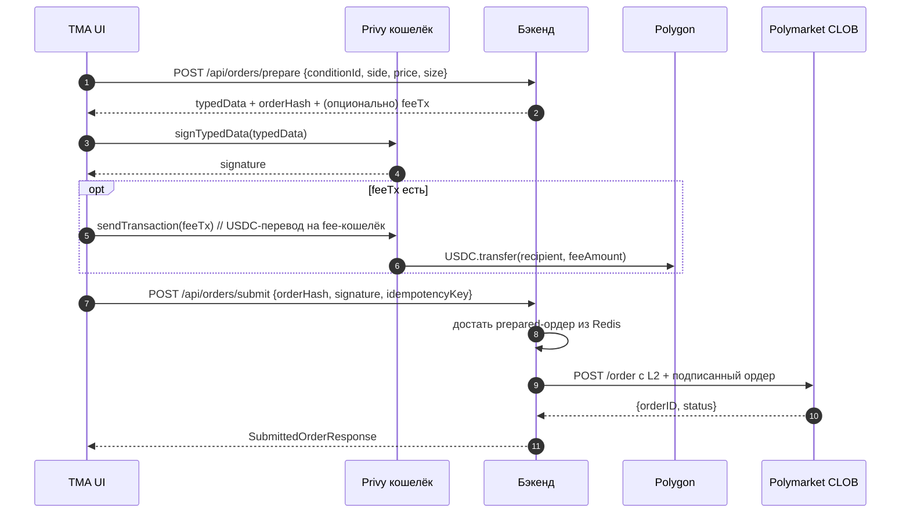
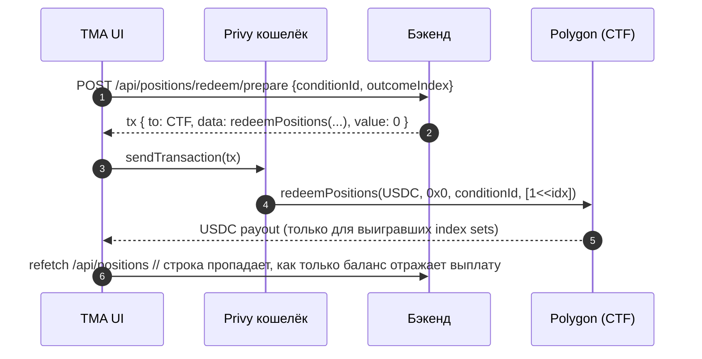

# Phase 2 — Статус торговли

Сделки на Polymarket рассчитываются через **CTF Exchange (Polygon)**. Бэкенд никогда не держит приватные ключи пользователей: браузер (**Privy**-кошелёк) подписывает **EIP-712** typed data, бэкенд шлёт подписанный ордер в **CLOB**. После итерации мая 2026 сквозной цикл **депозит → ставка → редим** собран целиком, плюс есть конфигурируемая платформенная комиссия (spread) на каждый подготавливаемый ордер.

## Phase 1 vs Phase 2 (что в репозитории)

| Область | Phase 1 (только чтение) | Phase 2 (торговый каркас) |
|---|---|---|
| Рынки, поиск | Gamma + публичный поиск → list/detail | То же |
| Стакан / цены | Gamma + публичный CLOB REST | То же |
| Поток цен | CLOB WS → STOMP `/topic/market/{…}` (опциональный тумблер) | То же |
| Идентификация | Telegram-авторизация, JWT | То же |
| Кошелёк | Опциональный Privy при `VITE_PRIVY_APP_ID` | Privy на Polygon + USDC `balanceOf` через viem |
| Ордера | — | `POST /api/orders/prepare`, `POST /api/orders/submit`, Redis pending-кэш, таблица `order_audit` |
| Submit в CLOB | — | `POST /order` с **L2 HMAC заголовками**, когда у пользователя есть выведенные API-ключи; иначе — без авторизации. Поток L1 (вывод ключей) на `/api/clob/auth/*` |
| Позиции | — | `GET /api/positions` → Data API `GET /positions?user=<wallet>` (Redis-кэш ~10s); ответ содержит title/icon/outcome/PnL/redeemable и флаг `favorite`, склеенный из локальной `favorite_market` |
| Cancel | — | `DELETE /api/orders/{orderId}` → CLOB `DELETE /order` с L2-заголовками через `ClobL2Signer`. Возвращает `CLOB_AUTH_REQUIRED`, если креденшелы не выведены. |
| Approvals USDC / CTF | — | `wallet/ApprovalCalldataBuilder`, `ApprovalStatusReader`, `ApprovalService`, `GET /api/wallet/approvals`; на фронте `ApprovalsSection.tsx` |
| Канонический **orderHash** | — | EIP-712 digest через web3j `StructuredDataEncoder`; поля `tokenId`/`uint256` идут как **decimal strings**, чтобы Privy/viem не теряли точность |
| Redeem / получение выигрыша | — | `POST /api/positions/redeem/prepare` → unsigned calldata `redeemPositions(...)`. Фронт `PositionRow` показывает кнопку Claim для каждой redeemable-позиции. |
| Платформенная комиссия (spread) | — | `app.fees.spread-bps` + `app.fees.recipient-address`. Если ставка ненулевая, `prepare` возвращает дополнительный USDC `transfer(recipient, fee)`, который кошелёк отправляет сразу после подписания ордера. Публичное превью на `GET /api/fees`. |

Ключевые файлы:

- [OrderBuilder.java](../backend/src/main/java/com/polymarket/tma/trading/OrderBuilder.java)
- [PendingOrderCache.java](../backend/src/main/java/com/polymarket/tma/trading/PendingOrderCache.java)
- [TradingService.java](../backend/src/main/java/com/polymarket/tma/trading/TradingService.java)
- [ClobOrderClient.java](../backend/src/main/java/com/polymarket/tma/trading/ClobOrderClient.java)
- [PositionsClient.java](../backend/src/main/java/com/polymarket/tma/trading/PositionsClient.java)
- [RedeemCalldataBuilder.java](../backend/src/main/java/com/polymarket/tma/redeem/RedeemCalldataBuilder.java) · [RedeemService.java](../backend/src/main/java/com/polymarket/tma/redeem/RedeemService.java) · [RedeemController.java](../backend/src/main/java/com/polymarket/tma/redeem/RedeemController.java)
- [FeeCalldataBuilder.java](../backend/src/main/java/com/polymarket/tma/fees/FeeCalldataBuilder.java) · [FeeService.java](../backend/src/main/java/com/polymarket/tma/fees/FeeService.java) · [FeeController.java](../backend/src/main/java/com/polymarket/tma/fees/FeeController.java)
- [MarketTradeSheet.tsx](../frontend/src/features/trading/MarketTradeSheet.tsx) — prepare → Privy `signTypedData` → опциональный feeTx → submit
- [PositionRow.tsx](../frontend/src/features/trading/PositionRow.tsx) — встроенная кнопка Claim на каждой redeemable-позиции
- [useWallet.ts](../frontend/src/features/wallet/useWallet.ts) — кошельки Privy + USDC на Polygon

## Сквозной поток ордера (актуальный)



## Сквозной поток redeem (новый)



---

## Сбои Privy «Sign and continue» — вероятные причины применительно к коду

Privy показывает обобщённое **«An error has occurred, please try again.»** При возможности логируйте оригинальную ошибку через DevTools / удалённый дебаг.

### 1. **Числовое кодирование `typedData` (закрыто в коде)**

[`OrderBuilder.build`](../backend/src/main/java/com/polymarket/tma/trading/OrderBuilder.java) выдаёт **все** `uint256` / `uint8` поля в `domain` и `message` как **decimal strings**, включая **`chainId`** в домене, поэтому крупные `tokenId` не округляются в JSON, и viem/Privy видят единое соглашение.

Если подпись всё равно падает — обычно дело в **не той сети**, **maker ≠ активный кошелёк**, либо в несовпадении **signatureType**.

### 2. **`wallets[0]` vs подписант, выбранный для EIP-712**

[`useWallet`](../frontend/src/features/wallet/useWallet.ts) берёт `address` из `wallets[0]`. Порядок embedded vs external может выдать «не тот» кошелёк. Подпись делается с `{ address: w.address }`, а `maker`/`signer` в typed data приходят из профиля БД (**после `api.setWalletAddress`**). Любое расхождение даёт ошибку подписи или верификации.

Лучше выбирать **именно embedded Polygon-кошелёк**, совпадающий с сохранённым профилем / `typedData.message.maker`.

### 3. **`signatureType` vs модель кошелька**

По умолчанию **EOA** (`signatureType = 0`). Polymarket часто работает через proxy/Safe; embedded smart-аккаунты могут требовать **POLY_PROXY / POLY_GNOSIS_SAFE** в соответствии с docs.

### 4. **`orderHash` vs учёт в CLOB**

`orderHash` API — это **EIP-712 struct hash** из web3j `StructuredDataEncoder` (тот же digest, что подписывает кошелёк). CLOB может использовать дополнительные id, как только L1/L2 submit полностью провязан; рассматривайте серверный `orderHash` как канонический digest подготовленных typed data.

---

## L1 / L2 авторизация CLOB (бэкенд)

В `backend/src/main/java/com/polymarket/tma/trading/clob`:

- `ClobAuthBuilder` — собирает EIP-712 `ClobAuth` typed data (домен `ClobAuthDomain`, chainId 137). Все uint — decimal strings.
- `ClobApiKeyClient` — `POST /auth/api-key` с заголовками `POLY_ADDRESS / POLY_SIGNATURE / POLY_TIMESTAMP / POLY_NONCE`. Возвращает `(apiKey, secret, passphrase)`.
- `ClobCredentialsStore` — креденшелы в Redis на пользователя, TTL 30 дней.
- `ClobL2Signer` — HMAC-SHA256 над `timestamp + METHOD + path + body`; URL-safe base64 на входе и выходе (как в py-clob-client).
- `ClobAuthController` — `/api/clob/auth/prepare | submit | status` (требует auth), `DELETE /api/clob/auth` для сброса.
- `ClobOrderClient.submit(...)` — добавляет заголовки `POLY_*`, если есть `creds`.
- `ClobOrderClient.cancel(orderId, wallet, creds)` — `DELETE /order` с L2-заголовками и телом `{"orderID": ...}`.

Фронтенд:

1. На странице Wallet кнопка «Connect to Polymarket trading»:
   - `POST /api/clob/auth/prepare`
   - Privy `signTypedData(typedData)`
   - `POST /api/clob/auth/submit { signature, timestamp, nonce }`
2. При отказе CLOB с 401/403 — фронт сбрасывает creds (`DELETE /api/clob/auth`) и предлагает заново вывести ключ.

## Approvals (USDC + Conditional Tokens)

В `backend/src/main/java/com/polymarket/tma/wallet`:

- `ApprovalCalldataBuilder` — чистая ABI-сборка `approve(address,uint256)` (selector `0x095ea7b3`) и `setApprovalForAll(address,bool)` (selector `0xa22cb465`).
- `ApprovalStatusReader` — опциональный Polygon JSON-RPC ридер для `allowance` (USDC) и `isApprovedForAll` (CTF). Возвращает `null`, если RPC недоступен — вызов деградирует мягко.
- `ApprovalService` — собирает список `UnsignedTx` (`to`, `data`, `value=0x0`, `chainId=137`) для всего, чего не хватает. Порог USDC ≥ `1_000_000` (1 USDC) считается approved.
- `ApprovalController` — `GET /api/wallet/approvals` (требует auth).

Polygon-адреса (в `application.yml`):

| Ключ | Значение |
|------|----------|
| `app.polygon.usdc-address` | `0x2791Bca1f2de4661ED88A30C99A7a9449Aa84174` |
| `app.polygon.ctf-address` | `0x4D97DCd97eC945f40cF65F87097ACe5EA0476045` |
| `app.polygon.ctf-exchange-address` (CTF Exchange v2) | `0xE111180000d2663C0091e4f400237545B87B996B` |
| `app.polygon.neg-risk-ctf-exchange-address` (NegRisk CTF Exchange v2) | `0xe2222d279d744050d28e00520010520000310F59` |

> **Важно (миграция CLOB v2, 2026-04-22).** Polymarket мигрировали свою CTF Exchange на v2 22 апреля 2026. Старый v1 (`0x4bFb41d5B3570DeFd03C39a9A4D8dE6Bd8B8982E`) с 30 апреля 2026 отдаёт `400 "order_version_mismatch"` на любые новые ордера. Старые approve USDC / CTF на v1 теперь бесполезны — пользователь должен заново выдать аппрув на v2-контракт при первой сделке. Эталонный код — [py-clob-client-v2](https://github.com/Polymarket/py-clob-client-v2); в наших исходниках актуальная схема живёт в `OrderBuilder`.

### Открытый внешний блокер — deposit-wallet flow (`CLOB_DEPOSIT_WALLET_REQUIRED`)

Даже с корректной v2-схемой EIP-712 Polymarket CLOB отбивает ордер, в котором `maker`/`signer` — это сырой EOA:

```
400 {"error":"maker address not allowed, please use the deposit wallet flow"}
```

Миграция 22 апреля 2026 фактически закрыла прямую торговлю с EOA. Теперь каждому кошельку нужен **deposit wallet** на стороне Polymarket: CREATE2-прокси, выводимый из EOA. Средства держит этот прокси, ордера подписываются с `signatureType=3` (POLY_1271, обёртка ERC-7739). Прокси *counterfactual*, пока пользователь не сделает хотя бы одну сделку через `polymarket.com` — после этого контракт деплоится и можно торговать через API.

На середину мая 2026 апстрим всё ещё сломан end-to-end:

- [py-clob-client-v2 #51](https://github.com/Polymarket/py-clob-client-v2/issues/51) — исходный отчёт «EOA-ордера отбиваются», открыт.
- [py-clob-client-v2 #53](https://github.com/Polymarket/py-clob-client-v2/issues/53) — подтверждает, что cutover 22 апреля убил EOA-режим.
- [py-clob-client-v2 #61](https://github.com/Polymarket/py-clob-client-v2/issues/61) — даже с `signatureType=2` и задеплоенным прокси новые аккаунты получают ту же 400.
- [py-clob-client-v2 #63](https://github.com/Polymarket/py-clob-client-v2/issues/63) — POLY_1271 (`signatureType=3`) отбивается, потому что L1 API key привязан к EOA, а signer ордера — прокси. Поддержка Polymarket подтвердила «это не ожидаемо», но фикса нет.
- [py-clob-client-v2 #64](https://github.com/Polymarket/py-clob-client-v2/issues/64) — диагностика «прокси ещё не задеплоен» и заметка, что Privy / соц-логин кошельки идут специальным TSS-путём.

**Что у нас сейчас работает:** `ClobOrderClient.mapClobError` транслирует 400 в структурированный код `CLOB_DEPOSIT_WALLET_REQUIRED`; в `MarketTradeSheet` тост показывает понятный текст «открой polymarket.com этим кошельком, внеси USDC, сделай маленькую сделку» вместо сырого тела ответа. Дальше — ждём, пока апстрим починит свою сторону.

**Что надо будет добавить, когда апстрим починят:**

1. Резолвить deposit-wallet-адрес пользователя из EOA — либо через HTML профиля Polymarket (поле `proxyAddress`), либо детерминированной CREATE2-деривацией, когда Polymarket опубликует правила (см. #61).
2. Переключить `OrderBuilder` на `signatureType=3`, `maker = proxy`, `signer = EOA`, и научить его собирать ERC-7739-обёрнутую POLY_1271 подпись (Privy `signTypedData` отдаёт внутренний EIP-712, обёртка — пост-обработка).
3. Сбрасывать L1/L2 credentials при смене maker; инвалидация кеша уже обрабатывается ре-деривацией на странице кошелька.

Фронтенд (`ApprovalsSection.tsx`): дёргает `GET /api/wallet/approvals`, шлёт каждый `missing[i]` обычной Polygon-транзой через Privy (`{to, data, value:'0x0', chainId:137}`), затем перезапрашивает статус.

## Redeem (получение выигрыша)

В `backend/src/main/java/com/polymarket/tma/redeem`:

- `RedeemCalldataBuilder` — чистое ABI-кодирование `redeemPositions(IERC20,bytes32,bytes32,uint256[])` для CTF. По умолчанию `parentCollectionId = 0x0` (top-level рынки Polymarket); `indexSet = 1 << outcomeIndex` для позиции, которую пользователь сжигает.
- `RedeemService` — по `(conditionId, outcomeIndex)` + кошельку вызывающего возвращает `UnsignedTx` на `app.polygon.ctf-address`.
- `RedeemController` — `POST /api/positions/redeem/prepare` (требует auth).

Фронтенд (`PositionRow.tsx`): кнопка Claim показывается, когда `position.redeemable === true`; на клик → `prepareRedeem` → Privy `useSendTransaction` → invalidate React-Query кэша `['positions']`. CTF делает revert безопасно, если рынок ещё не разрешён ончейн.

## maker / signer для каждого `signatureType`

В `PrepareOrderRequest` появилось опциональное поле **`makerAddress`**. Резолвинг в `TradingService.prepare`:

| signatureType | maker | signer |
|---|---|---|
| `EOA` (по умолчанию) | wallet | wallet |
| `POLY_PROXY` | обязательный `makerAddress` (proxy) | wallet |
| `POLY_GNOSIS_SAFE` | обязательный `makerAddress` (Safe) | wallet |

Для не-EOA запрос падает с `MAKER_REQUIRED`, если `makerAddress` пуст, или `MAKER_EQUALS_SIGNER`, если совпадает с кошельком. `OrderBuilder.build(maker, signer, req)` пишет два разных поля в EIP-712 message.

---

## Схема ордера CLOB v2

В апреле 2026 Polymarket заменили CTF Exchange — `OrderBuilder` и `ClobOrderClient` теперь собирают именно v2-схему. Поля и их представление на проводе:

| Поле | EIP-712 тип | JSON на проводе | Заметка |
|------|-------------|------------------|---------|
| `salt` | `uint256` | **JSON number** | Генерируется < 2^53, чтобы не терять точность при float64-парсинге на сервере |
| `maker` | `address` | строка | EOA-кошелёк или proxy/Safe, держащий средства |
| `signer` | `address` | строка | Всегда тот кошелёк, который подписывает |
| `tokenId` | `uint256` | строка | Decimal big-int — 256 бит, JSON number терял бы точность |
| `makerAmount` / `takerAmount` | `uint256` | строка | 6-знаковая шкала USDC / share-юнитов |
| `side` | `uint8` (0/1) | строка `"BUY"`/`"SELL"` | На проводе строка, в digest — uint8; CLOB восстанавливает значение на своей стороне |
| `signatureType` | `uint8` | **JSON number** | 0=EOA, 1=POLY_PROXY, 2=POLY_GNOSIS_SAFE |
| `timestamp` | `uint256` | строка ms | Новое в v2; заменяет v1-ный `nonce` для уникальности |
| `metadata` | `bytes32` | hex-строка | Новое в v2; по умолчанию `0x00…00` |
| `builder` | `bytes32` | hex-строка | Новое в v2; по умолчанию `0x00…00` (атрибуция билдера) |
| `expiration` | — *(только API)* | строка секунд | В v2 живёт только на проводе, в digest НЕ участвует. По умолчанию `"0"` (без срока) |
| `signature` | — | строка | Подпись кошелька лежит **внутри** объекта `order` |

Верхний уровень:

```json
{
  "order": { ... },
  "owner": "<API key UUID>",
  "orderType": "GTC",
  "deferExec": false,
  "postOnly": false
}
```

В v2 `owner` — это UUID L2-API-ключа (в v1 туда писали maker-кошелёк). EIP-712 домен — `name="Polymarket CTF Exchange"`, **`version="2"`**, `chainId=137`, `verifyingContract` переключается между стандартным контрактом и NegRisk в зависимости от `MarketDto.negRisk`.

Регрессионные тесты: [`OrderBuilderTest`](../backend/src/test/java/com/polymarket/tma/trading/OrderBuilderTest.java) (структура struct, диапазон salt, маршрутизация NegRisk) и [`ClobOrderClientPayloadTest`](../backend/src/test/java/com/polymarket/tma/trading/ClobOrderClientPayloadTest.java) (форма JSON на проводе, `owner`, `deferExec`/`postOnly`, отсутствие v1-полей).

---

## Монетизация — конфигурируемый spread / комиссия

На каждый подготавливаемый ордер можно начислять платформенную комиссию. Она **не зависит** от `feeRateBps` на стороне CLOB (тот зарезервирован за оператором биржи) и приходит обычным ERC-20 `transfer` на Polygon на сконфигурированный кошелёк.

### Конфигурация (`application.yml`)

| Ключ | Env | По умолчанию | Описание |
|---|---|---|---|
| `app.fees.spread-bps` | `TRADING_FEE_BPS` | `0` | Комиссия в базисных пунктах (100 = 1%, 50 = 0.5%). `0` отключает. |
| `app.fees.recipient-address` | `TRADING_FEE_RECIPIENT` | `""` | Polygon-адрес, получающий USDC. Пустой отключает. |

### Поток на проводе

1. `POST /api/orders/prepare` собирает ордер; [`FeeService.quote`](../backend/src/main/java/com/polymarket/tma/fees/FeeService.java) считает `fee = price × size × spreadBps / 10_000` (USDC, 6 знаков) и формирует `UnsignedTx` для `USDC.transfer(recipient, fee)`.
2. Ответ бэкенда несёт оригинальный `typedData` + `orderHash` и добавляет:

   ```json
   {
     "feeTx": { "kind": "TRADING_FEE_TRANSFER", "to": "<USDC>", "data": "0xa9059cbb…", "value": "0x0", "chainId": 137 },
     "feeAmountUsdc": "0.025",
     "feeBps": 50
   }
   ```
3. Фронт `MarketTradeSheet`:
   - подписывает ордер через Privy `signTypedData`,
   - если есть `feeTx`, шлёт его через Privy `useSendTransaction`,
   - сабмитит `{orderHash, signature}` в `POST /api/orders/submit`.
4. `GET /api/fees` отдаёт публичный конфиг комиссии, чтобы карточка ставки показывала превью (`Platform fee 0.50% · ≈ $0.025 USDC`) до подписания.

### Почему отдельный transfer (а не `feeRateBps` в CLOB)

Поле `feeRateBps` в EIP-712 ордере Polymarket уходит **оператору CLOB**, а не сторонней платформе, поэтому через него нельзя пустить долю проекта. Самый чистый MVP — отдельный USDC-перевод сразу после подписи: одна дополнительная Polygon-транза, газ платит пользователь, кошелёк-получатель видит чистый `transfer(...)` на каждую ставку.

### Ограничения / следующие шаги

- Комиссия снимается на **submit**, а не на fill. Если ордер не сматчится — комиссия всё равно собрана; такая модель «плата за размещение ставки» сознательно. Для модели «только при fill» нужен кастомный смарт-контракт-эскроу.
- Газ для комиссии оплачивается в MATIC. Дальше — спонсировать газ через paymaster (Privy session signers это умеют).
- В `order_audit` пока нет колонок `fee_amount` / `fee_tx_hash`. Их добавление — в production-чеклисте ниже.

## Геоблок — региональные ограничения Polymarket CLOB

CLOB сидит за Cloudflare и отклоняет `POST /order` (и ряд других эндпоинтов) с HTTP **403 «Trading restricted in your region»**, если outbound-IP сервера попадает в ограниченную юрисдикцию. Бэкенд распознаёт эту ошибку и поднимает специальный код `CLOB_GEOBLOCKED`, чтобы UI и логи давали внятное сообщение.

### Стратегия хостинга

Геоблок Polymarket шире чем просто «EU». Реализован через Cloudflare WAF на `POST /order` по комбинации страна + ASN. Эмпирически проверено на этом проекте плюс независимое подтверждение в [polymarket/clob-client#231](https://github.com/Polymarket/clob-client/issues/231) и [Polymarket Help Center — Geographic Restrictions](https://help.polymarket.com/en/articles/13364163-geographic-restrictions):

| Регион | International CLOB | Заметки |
|---|---|---|
| Hetzner **HEL1** (Хельсинки, Финляндия) | **работает** | Самый дешёвый стабильный вариант (~€5/мес). Рекомендуем для MVP. |
| AWS **eu-west-1** (Дублин, Ирландия) | **работает** | Polymarket origin сидит в AWS eu-west-2 London → ~0.5 мс латентность. Идеально для HFT. |
| Vultr **Стокгольм / Мадрид** | обычно работает | Зависит от /24 — проверять `clob-post-probe`. |
| DigitalOcean **ams3** (Амстердам) | как повезёт | UI Polymarket заблокирован для NL, но часть интеграторов пишет, что CLOB API оттуда работает. Можно дёшево попробовать перед сменой провайдера. |
| DigitalOcean **fra1 / lon1**, Hetzner **NBG/FSN/FRA**, Scaleway Paris | блок (Germany / UK / FR заблокированы) | |
| DigitalOcean / AWS **US-регионы** (nyc1, sfo3, us-east-1) | блок | International CLOB отшивает US IP; для США есть отдельный CFTC-регулируемый US API с KYC, это другой эндпоинт. |
| DigitalOcean **tor1 / sgp1 / blr1** | блок | CA / SG / IN. |

**Никаких residential / VPN-прокси** (Bright Data Residential, Oxylabs Residential, mobile-carrier IPv6 пулы и т.п.): даже при `loc=US` от Cloudflare, WAF Polymarket режет такие подсети по `proxy/threat_score>5`. Полимаркет в TOS §2.1.4 явно запрещает использование VPN. Datacenter IPv4 в разрешённой стране — единственный устойчивый путь.

### Operator-диагностика (`/api/diagnostics/*`)

Бэкенд публикует три публичных пробника, ходящих через тот же `WebClient`, что и реальный submit, чтобы можно было дебажить связь без редеплоя:

| Эндпоинт | Что показывает |
|---|---|
| `GET /api/diagnostics/clob-egress-ip` | IP, который видит upstream (`ifconfig.me/ip`). |
| `GET /api/diagnostics/cf-trace` | Cloudflare-trace. Самое важное — `loc=`. После деплоя должно быть `US`. |
| `GET /api/diagnostics/clob-post-probe[?ua=...]` | Шлёт пустой `POST /order`. В разрешённом регионе вернёт 400/401/422 (значит подпись/payload — единственное что осталось). 403 + «Trading restricted» = регион в блок-листе. Параметр `ua` подменяет User-Agent. |

Эндпоинты сознательно без авторизации — они не светят кредами, только публичный egress-IP и Cloudflare-классификацию.

### Порядок транзакций при ставке

На фронте: `prepare → sign → submit → fee tx`. Если CLOB отвергает ордер (геоблок или другая причина), ончейн-комиссия НЕ списывается. Раньше fee шёл до submit, и при геоблоке пользователь платил впустую.

## Production TODO (что осталось)

1. **Учёт fee tx hash** в строке `order_audit` (`fee_amount`, `fee_recipient`, `fee_tx_hash`) — миграция Flyway `V2__order_audit_fees.sql` + плюс провязка в сервисе.
2. **Уведомления** «рынок зарезолвился / можно redeem» (`docs/ToDo.txt` пункт C):
   - polling `/api/positions` на каждого активного пользователя раз в N минут,
   - кросс-чек `redeemable=true` → отправка сообщения через уже сконфигурированный `app.telegram.bot-token`,
   - дедуп по `(user, conditionId)`, чтобы одну выплату не объявлять дважды.
3. **Авторефреш approvals** — после подтверждения tx перечитывать состояние; пробрасывать tx hash в UI (наполовину сделано в `ApprovalsSection`).
4. **UI «My orders»** — открытых CLOB-ордеров пока нет в интерфейсе, поэтому уже подключённый `DELETE /api/orders/{id}` ждёт экрана списка.

---

## Контроль рисков

- Token bucket в Redis на пользователя по эндпоинтам ордеров (включается опцией).
- Серверный кап на `makerAmount` / номинал перед submit.
- Geo/KYC-гейты до разблокировки торговли.
- Killswitch уровня `app.trading.enabled=false` (когда будет провязан).
- Killswitch комиссии: `app.fees.spread-bps=0` отключает монетизацию без редеплоя остального.
